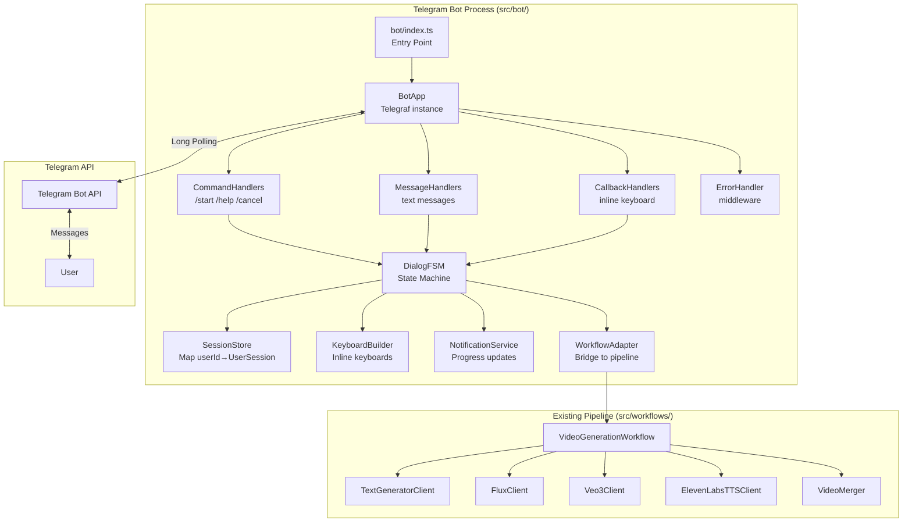
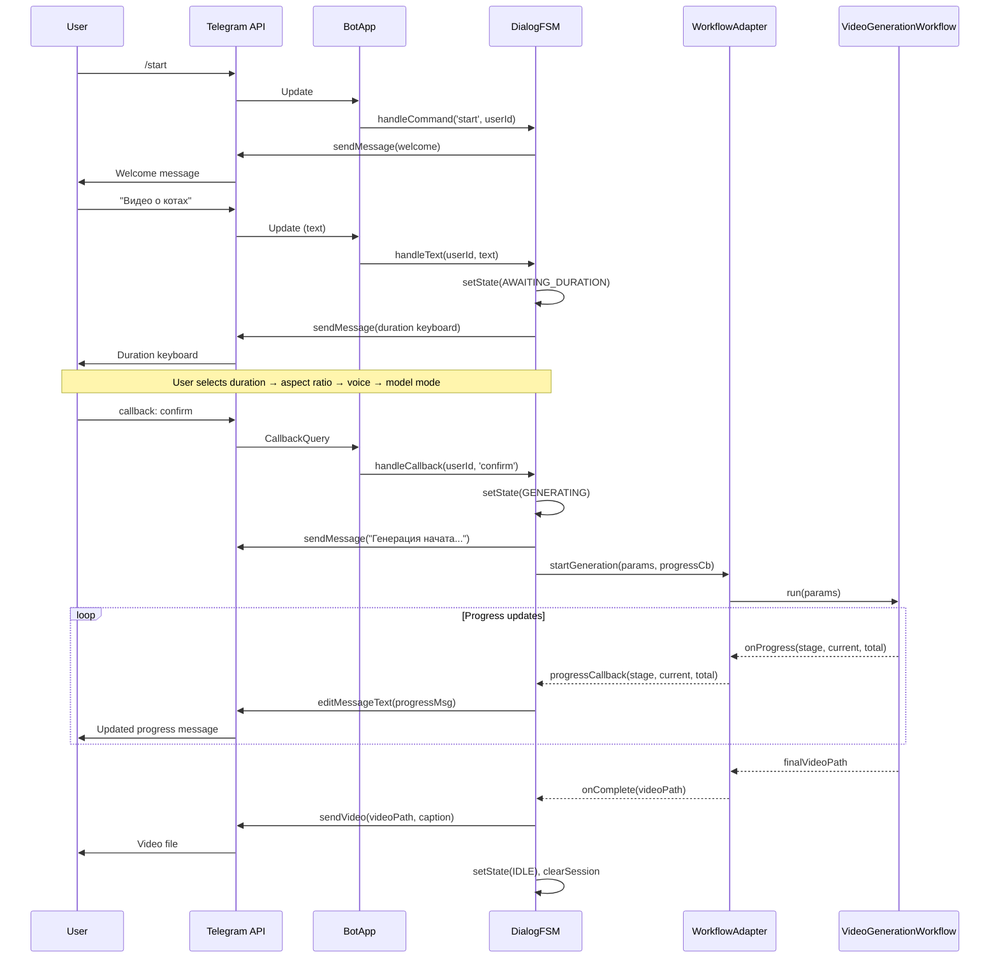
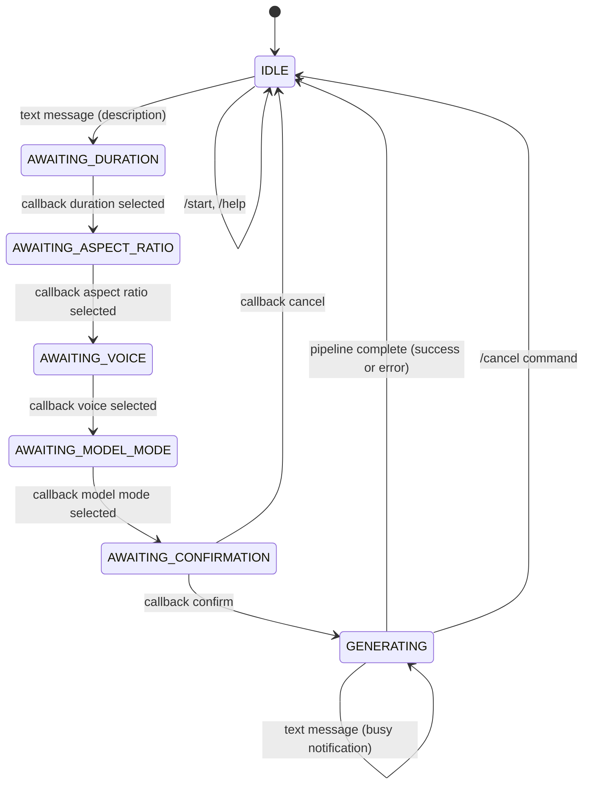

# Design Document: Telegram Bot Interface

## Overview

Данный документ описывает технический дизайн Telegram-бота для системы генерации видео TikTok-стиля. Бот является отдельным Node.js-процессом, который принимает запросы пользователей через Telegram, проводит их через многошаговый диалог выбора параметров и запускает существующий `VideoGenerationWorkflow` асинхронно, отправляя уведомления о прогрессе и доставляя готовое видео.

### Ключевые решения

- **Библиотека**: [Telegraf v4](https://telegraf.js.org/) — TypeScript-first фреймворк с middleware-архитектурой, встроенной поддержкой inline keyboards и сессий. Предпочтён `node-telegram-bot-api` из-за нативного TypeScript, активной поддержки Bot API 7.x и удобного middleware-паттерна для управления состоянием.
- **Режим получения обновлений**: Long polling (не webhook) — не требует публичного HTTPS-эндпоинта, подходит для локального и серверного запуска без дополнительной инфраструктуры.
- **Управление состоянием**: In-memory FSM (Finite State Machine) на основе `Map<userId, UserSession>` — состояние не персистируется между перезапусками согласно требованию 8.3.
- **Entry point**: Отдельный файл `src/bot/index.ts`, запускаемый независимо от React/Ink CLI-интерфейса.

---

## Architecture

Бот работает как самостоятельный процесс, изолированный от React/Ink UI. Он импортирует `VideoGenerationWorkflow` напрямую и вызывает его методы, передавая callback для уведомлений о прогрессе.



### Поток данных



---

## Components and Interfaces

### 1. Entry Point (`src/bot/index.ts`)

Точка входа: загружает `.env`, валидирует `TELEGRAM_BOT_TOKEN`, создаёт `BotApp`, регистрирует обработчики сигналов.

```typescript
// src/bot/index.ts
import 'dotenv/config';
import { BotApp } from './bot-app';

async function main(): Promise<void> {
  const token = process.env.TELEGRAM_BOT_TOKEN;
  if (!token) {
    console.error('❌ TELEGRAM_BOT_TOKEN is not set');
    process.exit(1);
  }

  const bot = new BotApp(token);
  await bot.start();

  process.once('SIGINT', () => bot.stop('SIGINT'));
  process.once('SIGTERM', () => bot.stop('SIGTERM'));
}

main().catch(console.error);
```

### 2. BotApp (`src/bot/bot-app.ts`)

Оборачивает экземпляр Telegraf, регистрирует middleware и обработчики.

```typescript
export class BotApp {
  private telegraf: Telegraf;
  private sessionStore: SessionStore;
  private dialogFSM: DialogFSM;

  constructor(token: string) { ... }

  async start(): Promise<void> {
    // Registers handlers, starts polling
    // Logs bot name/username on launch
  }

  stop(signal: string): void {
    this.telegraf.stop(signal);
  }
}
```

### 3. SessionStore (`src/bot/session-store.ts`)

In-memory хранилище состояний пользователей.

```typescript
export type DialogState =
  | 'IDLE'
  | 'AWAITING_DURATION'
  | 'AWAITING_ASPECT_RATIO'
  | 'AWAITING_VOICE'
  | 'AWAITING_MODEL_MODE'
  | 'AWAITING_CONFIRMATION'
  | 'GENERATING';

export interface GenerationParams {
  description: string;
  duration: 15 | 30 | 60;
  aspectRatio: '9:16' | '16:9';
  voiceId: string;
  useFreeModels: boolean;
}

export interface UserSession {
  userId: number;
  state: DialogState;
  params: Partial<GenerationParams>;
  progressMessageId?: number;  // ID сообщения о прогрессе для редактирования
  abortController?: AbortController;  // Для отмены генерации
}

export class SessionStore {
  private sessions = new Map<number, UserSession>();

  get(userId: number): UserSession {
    if (!this.sessions.has(userId)) {
      this.sessions.set(userId, { userId, state: 'IDLE', params: {} });
    }
    return this.sessions.get(userId)!;
  }

  set(userId: number, session: UserSession): void {
    this.sessions.set(userId, session);
  }

  clear(userId: number): void {
    this.sessions.set(userId, { userId, state: 'IDLE', params: {} });
  }

  has(userId: number): boolean {
    return this.sessions.has(userId);
  }
}
```

### 4. DialogFSM (`src/bot/dialog-fsm.ts`)

Конечный автомат, управляющий диалогом. Принимает события (команды, текст, callback) и выполняет переходы между состояниями.

```typescript
export class DialogFSM {
  constructor(
    private store: SessionStore,
    private notifier: NotificationService,
    private workflowAdapter: WorkflowAdapter,
    private accessGuard: AccessGuard
  ) {}

  async handleCommand(ctx: Context, command: string): Promise<void> { ... }
  async handleText(ctx: Context): Promise<void> { ... }
  async handleCallback(ctx: Context): Promise<void> { ... }
}
```

**Граф переходов состояний:**



### 5. NotificationService (`src/bot/notification-service.ts`)

Отвечает за отправку и редактирование сообщений о прогрессе. Использует `editMessageText` для обновления существующего сообщения вместо создания новых.

```typescript
export class NotificationService {
  constructor(private bot: Telegraf) {}

  async sendProgressMessage(chatId: number, text: string): Promise<number> {
    // Sends initial progress message, returns messageId
  }

  async updateProgressMessage(
    chatId: number,
    messageId: number,
    text: string
  ): Promise<void> {
    // Edits existing message via editMessageText
    // Retries up to 3 times with exponential backoff on Telegram API errors
  }

  async sendVideo(
    chatId: number,
    videoPath: string,
    caption: string
  ): Promise<void> {
    // Sends video file via sendVideo
    // Checks file size before sending (50MB limit)
  }

  async sendMessage(chatId: number, text: string, extra?: ExtraReplyMessage): Promise<void> {
    // Sends text message with retry logic
  }
}
```

### 6. WorkflowAdapter (`src/bot/workflow-adapter.ts`)

Мост между ботом и `VideoGenerationWorkflow`. Транслирует параметры бота в параметры workflow и прогресс-коллбэки.

```typescript
export interface ProgressCallback {
  (stage: PipelineStage, current?: number, total?: number): void;
}

export type PipelineStage =
  | 'story_generation'
  | 'prompt_generation'
  | 'image_generation'
  | 'video_generation'
  | 'audio_generation'
  | 'merging';

export class WorkflowAdapter {
  async run(
    params: GenerationParams,
    onProgress: ProgressCallback,
    signal: AbortSignal
  ): Promise<string> {
    // Creates VideoGenerationWorkflow instance
    // Runs pipeline stages sequentially, calling onProgress at each stage
    // Returns path to final video file
    // Checks signal.aborted before each stage for cancellation
  }
}
```

### 7. KeyboardBuilder (`src/bot/keyboard-builder.ts`)

Фабрика inline keyboards для каждого шага диалога.

```typescript
export const AVAILABLE_VOICES = [
  { id: 'JBFqnCBsd6RMkjVDRZzb', name: 'George (мужской, глубокий)' },
  { id: 'EXAVITQu4vr4xnSDxMaL', name: 'Bella (женский, мягкий)' },
  { id: 'pNInz6obpgDQGcFmaJgB', name: 'Adam (мужской, нейтральный)' },
];

export class KeyboardBuilder {
  static durationKeyboard(): InlineKeyboardMarkup { ... }
  static aspectRatioKeyboard(): InlineKeyboardMarkup { ... }
  static voiceKeyboard(): InlineKeyboardMarkup { ... }
  static modelModeKeyboard(): InlineKeyboardMarkup { ... }
  static confirmationKeyboard(): InlineKeyboardMarkup { ... }
}
```

### 8. AccessGuard (`src/bot/access-guard.ts`)

Проверяет, разрешён ли доступ пользователю на основе `TELEGRAM_ALLOWED_USER_IDS`.

```typescript
export class AccessGuard {
  private allowedIds: Set<number> | null;  // null = all users allowed

  constructor() {
    const raw = process.env.TELEGRAM_ALLOWED_USER_IDS;
    this.allowedIds = raw
      ? new Set(raw.split(',').map(id => parseInt(id.trim(), 10)))
      : null;
  }

  isAllowed(userId: number): boolean {
    return this.allowedIds === null || this.allowedIds.has(userId);
  }
}
```

---

## Data Models

### UserSession

```typescript
interface UserSession {
  userId: number;
  state: DialogState;           // Current FSM state
  params: Partial<GenerationParams>;  // Accumulated parameters
  progressMessageId?: number;   // Telegram message ID for editing
  abortController?: AbortController;  // For cancellation
  startedAt?: Date;             // Generation start time
}
```

### GenerationParams

```typescript
interface GenerationParams {
  description: string;          // User's video description
  duration: 15 | 30 | 60;      // Video duration in seconds
  aspectRatio: '9:16' | '16:9'; // Video aspect ratio
  voiceId: string;              // ElevenLabs voice ID
  useFreeModels: boolean;       // Use free AI models
}
```

### CallbackData

Callback data для inline keyboard кнопок кодируется как строки с префиксом:

```
duration:15        → выбор длительности 15 сек
duration:30        → выбор длительности 30 сек
duration:60        → выбор длительности 60 сек
aspect:9:16        → выбор соотношения сторон
aspect:16:9        → выбор соотношения сторон
voice:<voiceId>    → выбор голоса
mode:standard      → стандартные модели
mode:free          → бесплатные модели
confirm            → подтверждение генерации
cancel             → отмена
```

### Структура файлов

```
src/
  bot/
    index.ts              ← Entry point
    bot-app.ts            ← Telegraf setup & handler registration
    dialog-fsm.ts         ← FSM logic
    session-store.ts      ← In-memory state storage
    notification-service.ts ← Message sending with retry
    workflow-adapter.ts   ← Bridge to VideoGenerationWorkflow
    keyboard-builder.ts   ← Inline keyboard factories
    access-guard.ts       ← User allowlist check
    logger.ts             ← Timestamped logging
    types.ts              ← Shared types
```

### Новые скрипты в package.json

```json
{
  "scripts": {
    "bot": "tsx src/bot/index.ts",
    "bot:build": "tsc && node dist/bot/index.js"
  }
}
```

---

## Correctness Properties

*A property is a characteristic or behavior that should hold true across all valid executions of a system — essentially, a formal statement about what the system should do. Properties serve as the bridge between human-readable specifications and machine-verifiable correctness guarantees.*

После анализа критериев приёмки и выполнения property reflection для устранения избыточности, определены следующие свойства:

### Property 1: Любой не-командный текст запускает диалог выбора параметров

*For any* non-command text message sent by a user in IDLE state, the bot SHALL transition to AWAITING_DURATION state and send a duration selection keyboard.

**Validates: Requirements 3.1, 3.2**

---

### Property 2: Занятость — блокировка новых запросов во время генерации

*For any* user in GENERATING state, sending any text message SHALL result in a "busy" notification and the state SHALL remain GENERATING unchanged.

**Validates: Requirements 3.3**

---

### Property 3: Подтверждение получения описания содержит текст описания

*For any* non-empty, non-command text description, the bot's confirmation message SHALL contain the description text (or a recognizable truncated version of it).

**Validates: Requirements 3.4**

---

### Property 4: FSM-переходы при выборе параметров

*For any* valid parameter value at each step (duration ∈ {15, 30, 60}; aspectRatio ∈ {'9:16', '16:9'}; voiceId ∈ AVAILABLE_VOICES; modelMode ∈ {'standard', 'free'}), selecting that value SHALL transition the session to the next expected state and send the corresponding keyboard.

**Validates: Requirements 4.2, 4.3, 4.4**

---

### Property 5: Уведомления о прогрессе содержат название этапа

*For any* pipeline stage name, when the progress callback is invoked with that stage, the bot SHALL send or edit a message containing a human-readable representation of that stage name.

**Validates: Requirements 5.2**

---

### Property 6: Прогресс сегментов отображает корректное соотношение

*For any* pair (current, total) where 0 ≤ current ≤ total, the progress message for video segment generation SHALL contain both numbers in "current/total" format.

**Validates: Requirements 5.3**

---

### Property 7: Прогресс обновляется редактированием, а не новыми сообщениями

*For any* sequence of N ≥ 2 progress updates for the same generation session, `editMessageText` SHALL be called for updates 2..N, and `sendMessage` SHALL be called exactly once (for the initial progress message).

**Validates: Requirements 5.4**

---

### Property 8: Подпись к видео содержит все параметры генерации

*For any* combination of (description, duration, aspectRatio), the caption of the sent video message SHALL contain the description, duration value, and aspect ratio value.

**Validates: Requirements 6.2**

---

### Property 9: Изоляция состояний пользователей

*For any* two distinct user IDs A and B, setting the session state for user A SHALL NOT affect the session state of user B.

**Validates: Requirements 8.1, 8.4**

---

### Property 10: Сброс состояния после завершения генерации

*For any* terminal outcome of a generation (success, error, or cancellation), the user's session state SHALL be reset to IDLE after completion.

**Validates: Requirements 8.2**

---

### Property 11: Retry при ошибках Telegram API

*For any* sequence of up to 3 consecutive Telegram API failures, the notification service SHALL retry the send operation, and the delay between retries SHALL be at least double the previous delay (exponential backoff).

**Validates: Requirements 9.1**

---

### Property 12: Перехват исключений pipeline

*For any* Error thrown by the mocked WorkflowAdapter, the bot SHALL catch the exception and send an error message to the user without crashing the bot process.

**Validates: Requirements 9.2**

---

### Property 13: Неизвестные команды получают ответ

*For any* string matching `/^\/[a-z_]+$/` that is not in the set {'/start', '/help', '/cancel'}, the bot SHALL respond with an "unknown command" message.

**Validates: Requirements 9.3**

---

### Property 14: Логирование входящих сообщений с временными метками

*For any* incoming Telegram update, the logger SHALL output a line to stdout containing an ISO timestamp and a description of the update.

**Validates: Requirements 9.4**

---

### Property 15: Фильтрация по allowlist

*For any* user ID and any non-empty allowlist, the bot SHALL process the request if and only if the user ID is present in the allowlist.

**Validates: Requirements 10.2, 10.3**

---

## Error Handling

### Ошибки Telegram API

`NotificationService` оборачивает все вызовы Telegram API в retry-логику (до 3 попыток, экспоненциальная задержка: 1s → 2s → 4s). Используется существующий `RetryHelper` из `src/utils/retry-helper.ts`.

```typescript
await RetryHelper.retry(
  () => this.bot.telegram.sendMessage(chatId, text),
  { maxAttempts: 3, delayMs: 1000, backoffMultiplier: 2 }
);
```

### Ошибки Pipeline

`WorkflowAdapter.run()` оборачивается в `try/catch` в `DialogFSM`. При любом исключении:
1. Состояние сессии сбрасывается в `IDLE`
2. Пользователю отправляется сообщение об ошибке с кратким описанием
3. Ошибка логируется в stdout с временной меткой

### Отмена генерации

Используется `AbortController`. Перед каждым этапом `WorkflowAdapter` проверяет `signal.aborted`. При команде `/cancel` вызывается `abortController.abort()`, что прерывает текущий этап на следующей проверке.

### Превышение лимита размера файла (50 МБ)

Перед вызовом `sendVideo` проверяется размер файла через `fs.statSync`. Если размер > 50 МБ, пользователю отправляется уведомление с предложением уменьшить длительность.

### Неизвестные команды

Telegraf middleware перехватывает все сообщения, начинающиеся с `/`, которые не зарегистрированы как команды, и отвечает стандартным сообщением.

---

## Testing Strategy

### Подход

Используется **двойная стратегия тестирования**:
- **Unit-тесты** (Vitest): конкретные примеры, граничные случаи, обработка ошибок
- **Property-based тесты** (fast-check): универсальные свойства из раздела Correctness Properties

### Библиотека PBT

[fast-check](https://fast-check.io/) — TypeScript-first PBT библиотека, хорошо интегрируется с Vitest.

```bash
npm install --save-dev vitest fast-check
```

### Конфигурация property-тестов

Каждый property-тест запускается минимум **100 итераций** (fast-check default: 100).

Формат тега: `// Feature: telegram-bot-interface, Property N: <property_text>`

### Структура тестов

```
src/bot/__tests__/
  session-store.test.ts       ← Properties 9, 10
  dialog-fsm.test.ts          ← Properties 1, 2, 3, 4
  notification-service.test.ts ← Properties 5, 6, 7, 8, 11
  workflow-adapter.test.ts    ← Property 12
  access-guard.test.ts        ← Property 15
  logger.test.ts              ← Property 14
  bot-app.test.ts             ← Properties 13, unit tests for commands
```

### Примеры property-тестов

```typescript
// Feature: telegram-bot-interface, Property 1: Any non-command text triggers dialog
it('any non-command text transitions to AWAITING_DURATION', () => {
  fc.assert(
    fc.property(
      fc.string({ minLength: 1 }).filter(s => !s.startsWith('/')),
      (description) => {
        const store = new SessionStore();
        const fsm = createFSM(store);
        fsm.handleText(mockCtx(userId, description));
        expect(store.get(userId).state).toBe('AWAITING_DURATION');
      }
    )
  );
});

// Feature: telegram-bot-interface, Property 9: User state isolation
it('setting state for user A does not affect user B', () => {
  fc.assert(
    fc.property(
      fc.integer({ min: 1 }), fc.integer({ min: 1 }),
      fc.constantFrom('IDLE', 'AWAITING_DURATION', 'GENERATING' as DialogState),
      (userA, userB, stateA) => {
        fc.pre(userA !== userB);
        const store = new SessionStore();
        store.set(userA, { ...store.get(userA), state: stateA });
        expect(store.get(userB).state).toBe('IDLE');
      }
    )
  );
});
```

### Unit-тесты (примеры)

- `/start` → приветственное сообщение содержит инструкцию
- `/cancel` при IDLE → "нет активных запросов"
- `/cancel` при GENERATING → pipeline прерывается, состояние → IDLE
- Файл > 50 МБ → уведомление о лимите вместо sendVideo
- Отсутствие `TELEGRAM_BOT_TOKEN` → process.exit(1)

### Интеграционные тесты

- Запуск бота с реальным токеном (опционально, в CI с секретами)
- Проверка установки long polling соединения
